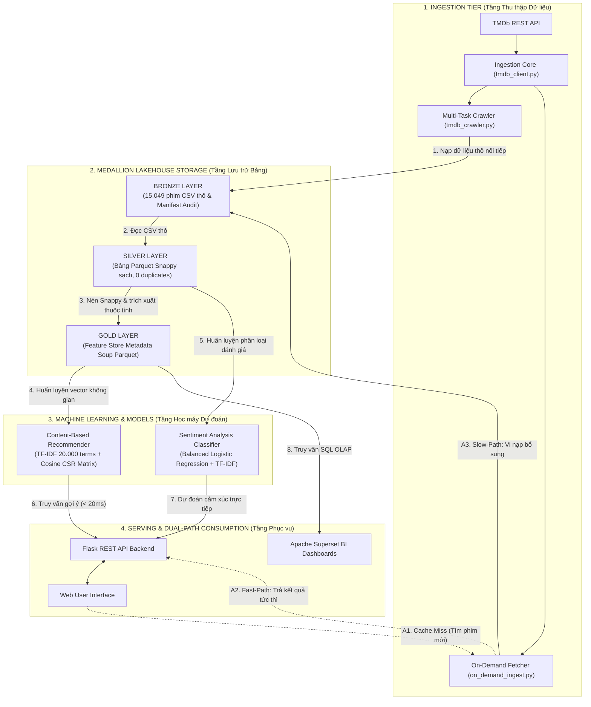

<div align="center">

# MOVIE AND TV SHOW DATA LAKEHOUSE PLATFORM
### *End-to-End Open-Source Data Engineering & AI Recommendation System*

[](https://www.python.org/)
[](https://scikit-learn.org/)
[](https://parquet.apache.org/)
[](https://iceberg.apache.org/)
[](https://min.io/)
[](https://flask.palletsprojects.com/)
[](LICENSE)

---

**Tác giả thực hiện:** [Lê Trần Tuấn Anh](https://github.com/tuanh250105) (MSSV: 23133003)  
**Đề tài:** *Xây dựng Data Platform sử dụng mã nguồn mở phục vụ hệ thống gợi ý phim*

</div>

---

## 1. Tổng quan dự án

Movie and TV Show Data Lakehouse Platform là hệ thống kỹ thuật dữ liệu và học máy toàn diện theo kiến trúc Medallion Lakehouse Architecture (Bronze, Silver, Gold). Hệ thống thu thập, chuẩn hóa và xử lý dữ liệu điện ảnh thực tế từ TMDb REST API với quy mô 15.049 bộ phim và 14.336 bài đánh giá của khán giả, phục vụ đồng thời cho Data Engineering, Machine Learning (hệ thống gợi ý phim theo nội dung và phân loại cảm xúc người dùng) và Business Intelligence.

---

## 2. Sơ đồ kiến trúc hệ thống



---

## 3. Thành phần kỹ thuật và công nghệ

| Tầng kiến trúc | Công nghệ sử dụng | Phạm vi kỹ thuật chi tiết |
| :--- | :--- | :--- |
| **Ingestion Layer** | Python 3, TMDb REST API, Requests | Thu thập dữ liệu đa chiều (Genres, Thematic Keywords, Regional Cinema, Eras, Streams), tích hợp bộ lọc 4 lớp, cơ chế phân bổ thời gian Fair-Share và chống trùng lặp qua bộ nhớ băm. |
| **Storage Layer** | Apache PyArrow, Apache Parquet, MinIO, Apache Iceberg | Lưu trữ tầng Bronze dạng CSV nối tiếp; chuyển đổi và nén cột Snappy Parquet ở tầng Silver và Gold giúp giảm ~60% dung lượng lưu trữ; thiết kế giao dịch ACID và Time Travel qua Iceberg. |
| **Data Processing Layer** | Pandas, PyArrow, PySpark | Khử trùng lặp bản ghi đạt độ chính xác 100%, ép kiểu schema nghiêm ngặt, phẳng hóa cấu trúc JSON lồng nhau trích xuất đạo diễn, diễn viên chính, biên kịch và nhà sản xuất. |
| **Feature Store & Gold** | Apache Parquet, NumPy, SciPy | Xây dựng đặc trưng tổng hợp Metadata Soup kết hợp tóm tắt cốt truyện và các trường dữ liệu danh mục có gán trọng số nhân bản để định hướng không gian vector. |
| **Machine Learning Tier** | Scikit-learn, SciPy Sparse CSR, Joblib | 1. Hệ thống gợi ý Content-Based Filtering: TF-IDF (20.000 đặc trưng, n-gram 1-2, sublinear TF) kết hợp Cosine Similarity ma trận thưa CSR 7,2 MB, độ trễ < 17 ms.<br/>2. Phân loại cảm xúc Sentiment Analysis: Logistic Regression có trọng số cân bằng lớp (`class_weight='balanced'`), đạt Macro F1 79,64% và ROC-AUC 0,8973 trên tập kiểm thử độc lập phân tầng. |
| **Serving & Dual-Path** | Flask REST API, On-Demand Ingestion | Kiến trúc hai luồng Fast-Path (phản hồi ngay lập tức từ bộ nhớ đệm) và Slow-Path (vi nạp tự động khi gặp cache miss); phục vụ truy vấn thời gian thực cho Web UI và báo cáo BI qua Apache Superset. |

---

## 4. Quy mô dữ liệu và chỉ số kiểm toán

Dữ liệu được kiểm toán toàn vẹn và xác thực chéo qua các tệp manifest JSON:

- **Bronze Layer (`data/raw/bronze_manifest.json`)**:
  - `movies_metadata.csv`: 15.049 bản ghi (21 cột, 16.938,79 KB).
  - `credits.csv`: 15.049 bản ghi (3 cột, 62.391,73 KB).
  - `keywords.csv`: 15.049 bản ghi (2 cột, 6.251,84 KB).
  - `links.csv`: 15.049 bản ghi (3 cột, 322,47 KB).
  - `ratings.csv`: 15.049 bản ghi (4 cột, 381,76 KB).
  - `reviews.csv`: 14.336 bản ghi (6 cột, 21.206,85 KB).
- **Silver Layer (`data/silver/silver_manifest.json`)**:
  - `silver_movies.parquet`: 15.049 bản ghi (24 cột, 6.898,00 KB).
  - `silver_credits.parquet`: 15.049 bản ghi (7 cột, 20.755,99 KB).
  - `silver_keywords.parquet`: 15.049 bản ghi (3 cột, 2.918,04 KB).
  - `silver_reviews.parquet`: 14.336 bản ghi (7 cột, 13.587,03 KB).
  - Tỷ lệ nén Snappy Parquet đạt ~2,4x đến 3,0x so với CSV thô.
- **Gold Layer & Machine Learning (`data/gold/gold_manifest.json`)**:
  - `gold_movies_features.parquet`: 15.049 bản ghi (21 cột, 14.229,51 KB, tỷ lệ rỗng Metadata Soup: 0%).
  - Content-Based Recommender: Kích thước ma trận thưa 7,2 MB, thời gian phản hồi truy vấn 15,7 - 16,3 ms.
  - Sentiment Analysis Classifier: Huấn luyện trên 14.245 bài đánh giá sạch, Accuracy đạt 85,22%, Balanced Accuracy đạt 81,15%, Macro F1 đạt 79,64%, ROC-AUC đạt 0,8973.

---

## 5. Cấu trúc thư mục repository

```
.
├── .env.example                        # Mẫu file cấu hình biến môi trường và API key
├── .gitignore                          # Cấu hình chặn commit dữ liệu cục bộ và secret
├── README.md                           # Tài liệu kỹ thuật tổng quan của repository
├── data/
│   ├── raw/                            # Tầng Bronze: 15.049 phim thô dạng CSV
│   │   ├── movies_metadata.csv
│   │   ├── credits.csv
│   │   ├── keywords.csv
│   │   ├── links.csv
│   │   ├── ratings.csv
│   │   ├── reviews.csv
│   │   └── bronze_manifest.json        # Manifest kiểm toán tính toàn vẹn tầng Bronze
│   ├── silver/                         # Tầng Silver: Bảng sạch Parquet Snappy và CSV
│   │   ├── silver_movies.parquet
│   │   ├── silver_credits.parquet
│   │   ├── silver_keywords.parquet
│   │   ├── silver_reviews.parquet
│   │   └── silver_manifest.json        # Manifest kiểm toán tính toàn vẹn tầng Silver
│   └── gold/                           # Tầng Gold: Feature Store và ma trận đặc trưng
│       ├── gold_movies_features.parquet
│       ├── gold_movies_features.csv
│       └── gold_manifest.json          # Manifest kiểm toán đặc trưng và mô hình
├── models/                             # Tệp nhị phân mô hình học máy đã huấn luyện
│   ├── recommender_tfidf.joblib        # Mô hình TF-IDF Vectorizer cho gợi ý phim
│   ├── recommender_index.joblib        # Bảng ánh xạ chỉ mục và ma trận thưa CSR
│   ├── sentiment_pipeline.joblib       # Pipeline TF-IDF và Balanced Logistic Regression
│   └── sentiment_metrics.json          # Báo cáo chi tiết các chỉ số đánh giá mô hình
└── src/
    ├── ingestion/                      # Bộ mã nguồn thu thập và nạp dữ liệu thô
    │   ├── tmdb_client.py              # Client kết nối TMDb API xử lý xác thực và giới hạn tần suất
    │   ├── tmdb_crawler.py             # Script cào đa luồng tích hợp bộ lọc 4 lớp và Fair-Share
    │   ├── on_demand_ingest.py         # Module cào động Fast-Path phục vụ truy vấn tức thì
    │   └── validate_bronze.py          # Kiểm toán dữ liệu thô và cập nhật manifest Bronze
    ├── pipeline/                       # Bộ mã nguồn biến đổi dữ liệu Lakehouse
    │   ├── spark_session.py            # Cấu hình kết nối PySpark và Apache Iceberg Catalog
    │   ├── transform_silver.py         # ETL làm sạch, khử trùng, ép kiểu và phẳng hóa JSON
    │   ├── validate_silver.py          # Kiểm toán dữ liệu sạch và cập nhật manifest Silver
    │   └── build_gold.py               # Kết hợp đa thuộc tính tạo Metadata Soup tầng Gold
    └── models/                         # Bộ mã nguồn huấn luyện và kiểm định mô hình học máy
        ├── train_recommendation.py     # Huấn luyện mô hình gợi ý theo nội dung (TF-IDF + Cosine)
        ├── train_sentiment.py          # Huấn luyện mô hình phân loại cảm xúc có trọng số cân bằng
        └── validate_gold.py            # Kiểm định chất lượng Feature Store và chạy smoke test mô hình
```

---

## 6. Giấy phép sử dụng

Dự án được phát hành theo giấy phép mã nguồn mở MIT License. Dữ liệu điện ảnh được cung cấp từ API chính thức của The Movie Database (TMDb).
