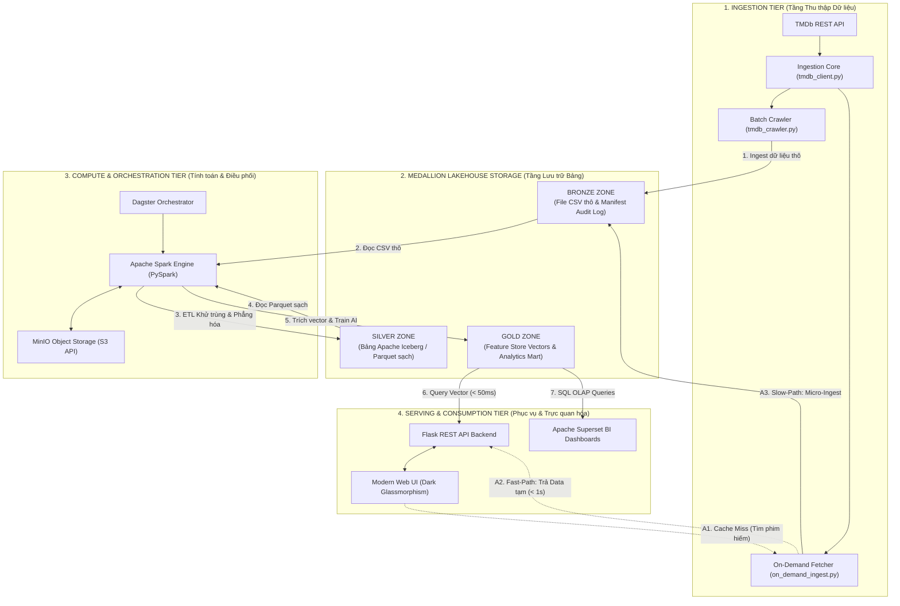

<div align="center">

# MOVIE AND TV SHOW DATA LAKEHOUSE PLATFORM
### *End-to-End Open-Source Data Engineering & AI Recommendation System*

[](https://www.python.org/)
[](https://spark.apache.org/)
[](https://iceberg.apache.org/)
[](https://min.io/)
[](https://flask.palletsprojects.com/)
[](LICENSE)

---

**Tác giả thực hiện:** [Lê Trần Tuấn Anh](https://github.com/tuanh250105)  
**Đề tài:** *Xây dựng Data Platform sử dụng mã nguồn mở phục vụ hệ thống gợi ý phim*

</div>

---

## 1. Tổng quan dự án

Movie and TV Show Data Lakehouse Platform là hệ thống xử lý và quản trị dữ liệu điện ảnh quy mô lớn theo kiến trúc Medallion Architecture (Bronze, Silver, Gold). Hệ thống thu thập dữ liệu thực tế từ TMDb REST API với quy mô 6.662 bộ phim và 10.758 bài đánh giá của khán giả, phục vụ đồng thời cho Data Engineering, Machine Learning và Business Intelligence.

---

## 2. Sơ đồ kiến trúc hệ thống



---

## 3. Thành phần kỹ thuật

| Tầng kiến trúc | Công nghệ sử dụng | Phạm vi triển khai kỹ thuật |
| :--- | :--- | :--- |
| **Ingestion Tier** | Python 3.10, TMDb REST API | Thu thập dữ liệu qua 5 luồng cào, bộ lọc 4 lớp, chống trùng lặp nối tiếp và cơ chế On-Demand Ingestion. |
| **Storage Tier** | MinIO Object Storage, Apache Iceberg | Lưu trữ file thô Bronze CSV, quản lý bảng Silver Parquet với giao dịch ACID, Snapshot và Time Travel. |
| **Compute Tier** | PySpark (Apache Spark 3.4) | Xử lý ETL phân tán, khử trùng lặp bản ghi, phẳng hóa cấu trúc JSON và nén dữ liệu dạng Snappy Parquet. |
| **ML & AI Tier** | PySpark MLlib, Scikit-learn | Xử lý chuỗi NLP (RegexTokenizer, StopWordsRemover, Word2Vec, TF-IDF), tính ma trận Cosine Similarity và huấn luyện Logistic Regression. |
| **Orchestration Tier** | Dagster | Điều phối lịch trình đường ống ETL theo mô hình Software-Defined Assets và quản lý Data Lineage. |
| **Serving & BI Tier** | Flask REST API, Apache Superset | Cung cấp JSON REST API cho Web UI và thực thi truy vấn SQL OLAP phục vụ báo cáo Dashboard. |

---

## 4. Cấu trúc thư mục repository

```
.
├── .env.example                        # Mẫu file cấu hình biến môi trường bảo mật
├── .gitignore                          # Cấu hình chặn commit secret & dữ liệu thô
├── README.md                           # Tài liệu hướng dẫn GitHub Repository
├── architecture_diagram.drawio.xml     # Sơ đồ kiến trúc dạng XML Draw.io
├── data/
│   ├── raw/                            # Bronze Layer Storage (6.662 phim & 10.758 reviews)
│   │   ├── movies_metadata.csv
│   │   ├── credits.csv
│   │   ├── keywords.csv
│   │   ├── links.csv
│   │   ├── ratings.csv
│   │   ├── reviews.csv
│   │   └── bronze_manifest.json
│   └── silver/                         # Silver Layer Storage (Bảng Parquet/Iceberg)
└── src/
    ├── ingestion/                      # Bộ mã nguồn Cào & Nạp dữ liệu thô (Bronze)
    │   ├── tmdb_client.py              # Client kết nối TMDb API (Auth & Rate Limiting 0.25s)
    │   ├── tmdb_crawler.py             # Script cào 5 luồng tích hợp Bộ lọc 4 Lớp & Incremental Crawl
    │   ├── on_demand_ingest.py         # Module cào động Fast-Path cho Web UI (< 1s)
    │   └── validate_bronze.py          # Validator kiểm tra dữ liệu thô & ghi manifest
    └── pipeline/                       # Bộ mã nguồn PySpark ETL (Silver Layer)
        ├── spark_session.py            # Khởi tạo PySpark Lakehouse Session
        ├── transform_silver.py         # PySpark ETL (Khử trùng, ép kiểu, phẳng hóa JSON)
        └── validate_silver.py          # Validator kiểm tra bảng sạch & ghi manifest
```

---

## 5. Giấy phép sử dụng

Dự án được phát hành theo giấy phép mã nguồn mở MIT License. Dữ liệu điện ảnh được cung cấp từ API chính thức của The Movie Database (TMDb).
