<div align="center">

# 🍿 MOVIE & TV SHOW DATA LAKEHOUSE PLATFORM
### *End-to-End Open-Source Data Engineering & AI Recommendation System*

[](https://www.python.org/)
[](https://spark.apache.org/)
[](https://iceberg.apache.org/)
[](https://min.io/)
[](https://flask.palletsprojects.com/)
[](LICENSE)

---

**Tác giả thực hiện:** [Lê Trần Tuấn Anh](https://github.com/)  
**Giảng viên hướng dẫn:** ThS. Nguyễn Văn Thành  
**Đề tài:** *Xây dựng Data Platform sử dụng mã nguồn mở phục vụ hệ thống gợi ý phim*

</div>

---

## 📌 TỔNG QUAN DỰ ÁN (PROJECT OVERVIEW)

**Movie & TV Show Data Lakehouse Platform** là một hệ thống Data Platform hiện đại được thiết kế theo kiến trúc **Data Lakehouse (Medallion Architecture: Bronze ➔ Silver ➔ Gold)**. 

Dự án thu thập, xử lý và quản trị dữ liệu điện ảnh quy mô lớn từ **TMDb API**, phục vụ đồng thời cho cả **Data Engineering**, **Machine Learning** (Gợi ý phim Content-Based & Phân tích cảm xúc Sentiment Analysis) và **Business Intelligence (BI)**.

### 🌟 ĐIỂM SÁNG KIẾN TRÚC: KIẾN TRÚC LUỒNG KÉP (DUAL-PATH ARCHITECTURE)
Để tối ưu hóa mâu thuẫn giữa độ trễ Web UI (< 1s) và chi phí tính toán nặng của PySpark Batch ETL:
- ⚡ **Fast-Path Serving (< 1s)**: Khi xảy ra Cache Miss (người dùng tìm phim hiếm chưa có trong DB), `on_demand_ingest.py` cào nhanh metadata từ TMDb API, nạp tạm vào RAM Flask Backend và trả kết quả tức thời cho Web UI trong **< 1 giây**.
- 🐢 **Slow-Path Async Batch Engine**: Đồng thời, dữ liệu thô được nạp vào **Bronze Layer** và kích hoạt tiến trình **PySpark ETL running in background** để làm sạch, phẳng hóa JSON, ghi bảng **Apache Iceberg (Silver)** và cập nhật Ma trận Vector toàn cục ở **Gold Layer**.

---

## 🏗️ SƠ ĐỒ KIẾN TRÚC TỔNG THỂ (SYSTEM ARCHITECTURE)

```mermaid
flowchart TD
    subgraph INGESTION ["🌐 1. INGESTION TIER (Tầng Thu thập Dữ liệu)"]
        TMDB["🌐 TMDb REST API"]
        Client["🔑 tmdb_client.py (Auth, Rate Limiter & Retry)"]
        Crawler["🚀 tmdb_crawler.py (5-Stream Crawl & 4-Layer Filter)"]
        OnDemand["⚡ on_demand_ingest.py (Fast-Path Catch-all)"]
        
        TMDB -->|"HTTPS GET (Raw JSON)"| Client
        Client -->|"Rate-Limited Session (0.25s)"| Crawler
        Client -->|"Rate-Limited Session (0.25s)"| OnDemand
    end

    subgraph LAKEHOUSE ["💾 2. MEDALLION LAKEHOUSE TIER (Tầng Lưu trữ Bảng)"]
        subgraph BRONZE ["🥉 BRONZE ZONE (Raw CSVs)"]
            b_movies["movies_metadata.csv (1.662 phim)"]
            b_reviews["reviews.csv (3.727 reviews)"]
            b_manifest["bronze_manifest.json"]
        end

        subgraph SILVER ["🥈 SILVER ZONE (Apache Iceberg / Parquet)"]
            s_movies["silver_movies.parquet (Data sạch)"]
            s_credits["silver_credits.parquet (Flattened)"]
            s_keywords["silver_keywords.parquet"]
            s_reviews["silver_reviews.parquet (Normalized)"]
            s_catalog["Iceberg Metadata Catalog"]
            s_movies & s_credits & s_keywords & s_reviews -. "Managed by" .-> s_catalog
        end

        subgraph GOLD ["🥇 GOLD ZONE (Feature Store & Analytics)"]
            g_features["gold_movie_features.parquet (Vector Store)"]
            g_sentiment["gold_sentiment_model.bin (LogReg Model)"]
            g_marts["gold_analytics_aggregates (BI Mart)"]
        end
    end

    subgraph ENGINE ["⚡ 3. COMPUTE & ORCHESTRATION TIER"]
        Spark["🔥 Apache Spark (PySpark ETL & MLlib)"]
        Dagster["⚙️ Dagster Orchestrator"]
        MinIO["📦 MinIO Object Storage (S3 Storage)"]
        
        Dagster -->|"Orchestrates Pipelines"| Spark
        Spark <-->|"S3 Protocol"| MinIO
    end

    subgraph SERVING ["🖥️ 4. SERVING & CONSUMPTION TIER"]
        Flask["🐍 Flask REST API Backend"]
        WebUI["🍿 Modern Web UI (Dark Glassmorphism)"]
        Superset["📊 Apache Superset BI"]
        
        Flask <-->|"REST API Protocols"| WebUI
    end

    %% Data Lineage Flow
    Crawler -->|"1. Append Raw CSVs"| b_movies
    Crawler -->|"1. Append Raw Reviews"| b_reviews
    b_movies & b_reviews -->|"2. Read Raw CSVs"| Spark
    Spark -->|"3. PySpark ETL (Cast, Deduplicate, Flatten)"| s_movies & s_reviews & s_credits & s_keywords
    s_movies & s_credits & s_reviews -->|"4. Read Cleaned Tables"| Spark
    Spark -->|"5. ML Feature Extraction"| g_features & g_sentiment & g_marts
    
    g_features -->|"6. Vector Query (< 50ms)"| Flask
    g_sentiment -->|"7. Realtime Sentiment Inference"| Flask
    g_marts -->|"8. SQL OLAP Queries"| Superset
    
    WebUI -. "9. Search Miss Event" .-> OnDemand
    OnDemand -->|"10a. FAST-PATH: Trả Data siêu tốc (< 1s)"| Flask
    OnDemand -->|"10b. SLOW-PATH: Micro-Ingest"| b_movies
```



---

## 🛠️ TÍNH NĂNG KỸ THUẬT NỔI BẬT (KEY TECHNICAL FEATURES)

1. **Storage-Compute Decoupling**: Tách biệt hoàn toàn PySpark (Compute Engine) và MinIO (S3 Object Storage).
2. **Bộ cào TMDb 5 Luồng & Bộ lọc 4 Lớp**: Cào tự động Phim Hot, Phim Kinh điển, Phim Trending, Phim Hàng độc (Cult Classics) và Phim Bộ (TV Series) dựa trên bộ lọc số vote, thời lượng và tính toàn vẹn dữ liệu.
3. **Cơ chế Chống trùng Nối tiếp (Incremental Crawl)**: Tự động tải danh sách ID cũ vào bộ nhớ, đảm bảo mọi lần cào sau chỉ lấy phim mới 100%.
4. **PySpark ETL Silver Layer**: Khử trùng lặp bản ghi (`dropDuplicates`), ép kiểu chuẩn (`release_date`, `budget`, `revenue`, `vote_average`), phẳng hóa các mảng JSON phức tạp (`genres`, `cast`, `crew`, `keywords`).
5. **AI Feature Store & Sentiment Analysis**:
   - **Content-Based Recommendation**: Chuỗi NLP (`RegexTokenizer` ➔ `StopWordsRemover` ➔ `Word2Vec`/`TF-IDF`) ➔ Tính tương đồng góc **Cosine Similarity**.
   - **Sentiment Analysis**: Trọng số **TF-IDF** ➔ Phân loại cảm xúc bằng **Logistic Regression Classifier**.

---

## 📁 CẤU TRÚC THƯ MỤC REPOSITORY

```
.
├── .env.example                        # Mẫu file cấu hình biến môi trường bảo mật
├── .gitignore                          # Cấu hình chặn commit secret & dữ liệu thô
├── README.md                           # Tài liệu hướng dẫn GitHub Repository
├── architecture_diagram.drawio.xml     # Sơ đồ kiến trúc dạng XML Draw.io
├── docs/                               # Thư mục chứa toàn bộ tài liệu kỹ thuật & báo cáo
│   ├── tai_lieu_ky_thuat_he_thong.md   # Tài liệu Kỹ thuật hệ thống tổng hợp
│   ├── bao_cao_y_tuong_va_tien_do_gui_gvhd.md # Báo cáo tiến độ gửi Giảng viên hướng dẫn
│   └── so_do_kien_truc_chi_tiet.md   # Sơ đồ Kiến trúc chi tiết các Layer (Mermaid)
├── data/
│   ├── raw/                            # Bronze Layer Storage (1.662 phim & 3.727 reviews)
│   │   ├── movies_metadata.csv
│   │   ├── credits.csv
│   │   ├── keywords.csv
│   │   ├── links.csv
│   │   ├── ratings.csv
│   │   ├── reviews.csv
│   │   └── bronze_manifest.json
│   └── silver/                         # Silver Layer Storage (Bảng Parquet/Iceberg)
└── src/
    ├── ingestion/                      # Bộ mã nguồn Cào & Nạp dữ liệu thô (Bronze)
    │   ├── tmdb_client.py              # Client kết nối TMDb API (Auth & Rate Limiting 0.25s)
    │   ├── tmdb_crawler.py             # Script cào 5 luồng tích hợp Bộ lọc 4 Lớp & Incremental Crawl
    │   ├── on_demand_ingest.py         # Module cào động Fast-Path cho Web UI (< 1s)
    │   └── validate_bronze.py          # Validator kiểm tra dữ liệu thô & ghi manifest
    └── pipeline/                       # Bộ mã nguồn PySpark ETL (Silver Layer)
        ├── spark_session.py            # Khởi tạo PySpark Lakehouse Session
        ├── transform_silver.py         # PySpark ETL (Khử trùng, ép kiểu, phẳng hóa JSON)
        └── validate_silver.py          # Validator kiểm tra bảng sạch & ghi manifest
```

---

## 🚀 HƯỚNG DẪN CHẠY DỰ ÁN (QUICKSTART GUIDE)

### 1. Cài đặt Môi trường & Khởi tạo Secret `.env`
```bash
# Clone repository về máy
git clone https://github.com/your-username/movie-data-lakehouse-platform.git
cd movie-data-lakehouse-platform

# Tạo virtual environment và cài đặt dependencies
python -m venv venv
source venv/bin/activate  # Trên Windows: venv\Scripts\activate
pip install -r requirements.txt

# Tạo file .env chứa TMDB_API_KEY bảo mật
echo "TMDB_API_KEY=your_tmdb_api_key_here" > .env
echo "TMDB_BASE_URL=https://api.themoviedb.org/3" >> .env
```

### 2. Chạy Cào Dữ liệu Thật vào Bronze Layer (`data/raw/`)
```bash
# Cào 1.000 phim & TV series mới (từ 1990 - 2026)
python src/ingestion/tmdb_crawler.py --limit 1000 --start-year 1990 --end-year 2026

# Hoặc hẹn giờ cào tự động đúng 5 phút
python src/ingestion/tmdb_crawler.py --limit 3000 --max-runtime-min 5

# Kiểm tra báo cáo Bronze Layer Manifest
python src/ingestion/validate_bronze.py
```

### 3. Thực thi PySpark ETL Làm sạch Dữ liệu vào Silver Layer (`data/silver/`)
```bash
# Thực thi PySpark ETL làm sạch, khử trùng lặp & phẳng hóa JSON
python src/pipeline/transform_silver.py

# Kiểm tra báo cáo Silver Layer Manifest
python src/pipeline/validate_silver.py
```

---

## 📄 GIẤY PHÉP & BẢN QUYỀN (LICENSE & CREDITS)

- Dự án được phát hành dưới giấy phép mã nguồn mở [MIT License](LICENSE).
- Dữ liệu điện ảnh được cung cấp qua API chính thức từ [The Movie Database (TMDb)](https://www.themoviedb.org/).

<div align="center">
  <sub>Built with ❤️ by <b>Lê Trần Tuấn Anh</b> under guidance of <b>ThS. Nguyễn Văn Thành</b></sub>
</div>
