# BÁO CÁO Ý TƯỞNG THIẾT KẾ VÀ TIẾN ĐỘ THỰC HIỆN DỰ ÁN

**Đề tài**: XÂY DỰNG DATA PLATFORM SỬ DỤNG MÃ NGUỒN MỞ PHỤC VỤ HỆ THỐNG GỢI Ý PHIM  
**Tác giả thực hiện**: Lê Trần Tuấn Anh  
**Ngày báo cáo**: 25/08/2026  

---

## 1. Ý TƯỞNG XÂY DỰNG DỰ ÁN (CORE BUILD IDEA)

### 1.1. Bối cảnh và Thách thức Bài toán
Dữ liệu ngành điện ảnh hiện nay sở hữu đầy đủ đặc trưng của dữ liệu lớn (Big Data):
- **Quy mô lớn & Tăng trưởng nhanh**: Hàng ngàn bộ phim cùng hàng triệu lượt đánh giá (ratings) và bài nhận xét (reviews).
- **Đa dạng về cấu trúc**: Bao gồm dữ liệu bảng có cấu trúc (doanh thu, ngân sách, ngày phát hành), dữ liệu bán cấu trúc (danh sách thể loại, diễn viên, đạo diễn dưới dạng mảng JSON), và dữ liệu phi cấu trúc (văn bản nhận xét review).
- **Hạn chế của mô hình cũ**: Kho dữ liệu truyền thống (Data Warehouse) đắt đỏ và khó lưu dữ liệu phi cấu trúc; trong khi Hồ dữ liệu (Data Lake) dễ biến thành "Đầm lầy dữ liệu" (Data Swamp) vì thiếu khả năng quản trị giao dịch.

### 1.2. Ý tưởng Giải pháp: Mô hình Data Lakehouse Phân lớp Medallion
Tác giả đề xuất xây dựng một hệ thống **Data Platform** tiên tiến theo kiến trúc **Data Lakehouse** kết hợp mô hình phân lớp dữ liệu **Medallion Architecture (Bronze ➔ Silver ➔ Gold)**:
- Vừa giữ được chi phí lưu trữ thấp và tính linh hoạt của Data Lake.
- Vừa đảm bảo tính quản trị, toàn vẹn giao dịch (ACID) và hiệu năng truy vấn của Data Warehouse.
- Làm nền tảng thống nhất phục vụ đồng thời cho **Data Engineering**, **Machine Learning** (Gợi ý phim & Phân tích cảm xúc) và **Business Intelligence (BI)**.

---

## 2. LUỒNG HOẠT ĐỘNG CHÍNH CỦA HỆ THỐNG (MAIN EXECUTION FLOW)

Luồng xử lý dữ liệu End-to-End được vận hành theo sơ đồ kiến trúc sau:

```mermaid
flowchart TB
    subgraph INGESTION["1. INGESTION & DATA COLLECTION TIER (Tầng Thu thập Dữ liệu)"]
        node_tmdb["External API: TMDb REST Services"]
        node_client["Ingestion Core: tmdb_client.py (Auth, Rate Limiter & Retry)"]
        node_crawler["Batch Ingestion: tmdb_crawler.py (5-Stream Crawl & 4-Layer Filter)"]
        node_ondemand["Event Ingestion: on_demand_ingest.py (Realtime Catch-all, Async)"]
    end

    subgraph BRONZE_ZONE["BRONZE ZONE (Raw / Unprocessed Data - Schema-on-Read)"]
        b_movies["movies_metadata.csv"]
        b_reviews["reviews.csv"]
        b_credits["credits.csv"]
        b_keywords["keywords.csv"]
        b_manifest["bronze_manifest.json (Audit Log)"]
    end

    subgraph SILVER_ZONE["SILVER ZONE (Trusted Data - Schema Enforced Iceberg Tables)"]
        s_movies["silver_movies (Iceberg / Parquet)"]
        s_credits["silver_credits (Flattened JSON)"]
        s_keywords["silver_keywords (Flattened)"]
        s_reviews["silver_reviews (Cleaned Sentiment)"]
        s_catalog["Iceberg Metadata Catalog (Snapshots & Manifest Tree)"]
    end

    subgraph GOLD_ZONE["GOLD ZONE (Curated Data / Feature Store & Analytics Mart)"]
        g_features["gold_movie_features (Vector Feature Store)"]
        g_sentiment["gold_sentiment_model (Serialized ML Model)"]
        g_marts["gold_analytics_aggregates (OLAP BI Mart)"]
    end

    subgraph LAKEHOUSE["2. MEDALLION DATA LAKEHOUSE TIER (Tầng Lưu trữ & Quản trị Bảng)"]
        BRONZE_ZONE
        SILVER_ZONE
        GOLD_ZONE
    end

    subgraph ENGINE_TIER["3. COMPUTE & ORCHESTRATION TIER (Động cơ Tính toán & Điều phối)"]
        node_spark["Distributed Compute: Apache Spark (PySpark Core & MLlib)"]
        node_dagster["Data Pipeline Orchestration: Dagster (Software-Defined Assets)"]
        node_minio["Object Storage: MinIO (Amazon S3 Compatible API)"]
    end

    subgraph SERVING_TIER["4. SERVING & CONSUMPTION TIER (Tầng Phục vụ & Trực quan hóa)"]
        node_flask["Application Backend: Flask REST API Engine"]
        node_webui["End-User Client: Modern Web UI (Dark Glassmorphism)"]
        node_superset["BI & Analytics: Apache Superset (SQL OLAP Dashboards)"]
    end

    node_tmdb -->|"HTTPS GET (Raw JSON)"| node_client
    node_client -->|"Rate-Limited Session (0.25s)"| node_crawler
    node_client -->|"Rate-Limited Session (0.25s)"| node_ondemand

    s_movies -. "Managed by" .-> s_catalog
    s_credits -. "Managed by" .-> s_catalog
    s_keywords -. "Managed by" .-> s_catalog
    s_reviews -. "Managed by" .-> s_catalog

    node_dagster -->|"Orchestrates Scheduled Assets"| node_spark
    node_spark <-->|"S3 Protocol (s3a://)"| node_minio
    node_spark -. "Query Snapshots / Time Travel" .-> s_catalog

    node_flask <-->|"JSON REST Protocols"| node_webui

    node_crawler -. "Write Raw Files" .-> node_minio

    node_crawler -->|"1. Raw Movies Ingestion (Append-Only)"| b_movies
    node_crawler -->|"1. Raw Reviews Ingestion"| b_reviews
    node_crawler -->|"1. Raw Credits Ingestion"| b_credits
    node_crawler -->|"1. Raw Keywords Ingestion"| b_keywords
    node_crawler -. "1. Write Audit Entry" .-> b_manifest

    b_manifest -. "Pipeline Health / Observability" .-> node_dagster

    b_movies -->|"2. Batch Read Raw CSVs"| node_spark
    b_reviews -->|"2. Batch Read Raw CSVs"| node_spark
    b_credits -->|"2. Batch Read Raw CSVs"| node_spark
    b_keywords -->|"2. Batch Read Raw CSVs"| node_spark

    node_spark -->|"3. Silver Transformation ETL (Deduplicate, Cast, Flatten JSON)"| s_movies
    node_spark -->|"3. Clean & Normalize Reviews"| s_reviews
    node_spark -->|"3. Flatten Credits"| s_credits
    node_spark -->|"3. Flatten Keywords"| s_keywords

    s_movies -->|"4. Read Trusted Parquet Tables"| node_spark
    s_credits -->|"4. Read Trusted Parquet Tables"| node_spark
    s_keywords -->|"4. Read Trusted Parquet Tables"| node_spark
    s_reviews -->|"4. Read Trusted Parquet Tables"| node_spark

    node_spark -->|"5. ML Feature Extraction (Genres + Keywords + Cast via Word2Vec/TF-IDF)"| g_features
    node_spark -->|"5. Train Sentiment Classifier (Logistic Reg.)"| g_sentiment
    node_spark -->|"5. Build BI Aggregates"| g_marts

    g_features -->|"6. Low-Latency Feature Query (< 50ms)"| node_flask
    g_sentiment -->|"7. Realtime Sentiment Inference"| node_flask
    g_marts -->|"8. SQL OLAP Queries"| node_superset

    node_webui -. "A1. Search Miss Event (Cache Miss)" .-> node_ondemand
    node_ondemand -. "A2. Fast-Path Response (Bypass ETL, Minimal Fields)" .-> node_flask
    node_ondemand -->|"A3. Async Micro-Ingest"| b_movies
    node_ondemand -->|"A3. Async Micro-Ingest"| b_credits
    node_ondemand -->|"A3. Async Micro-Ingest"| b_reviews

    b_movies -. "A4. Next Scheduled Run Picks Up New Rows" .-> node_dagster
    b_credits -. "A4. Next Scheduled Run Picks Up New Rows" .-> node_dagster
    b_reviews -. "A4. Next Scheduled Run Picks Up New Rows" .-> node_dagster
```



---

## 3. TRÌNH BÀY CHI TIẾT TECHNICAL: TẠI SAO SỬ DỤNG & SỬ DỤNG ĐỂ LÀM GÌ?

### 3.1. MinIO Object Storage
- **Tại sao sử dụng?** Là giải pháp lưu trữ đối tượng mã nguồn mở tương thích hoàn toàn với Amazon S3 API, chi phí tối ưu hơn nhiều so với CSDL quan hệ truyền thống và dễ dàng mở rộng dung lượng lên hàng Terabyte.
- **Sử dụng để làm gì?** Đóng vai trò tầng lưu trữ file vật lý cho cả 3 lớp dữ liệu Bronze, Silver và Gold trong Lakehouse.

### 3.2. Apache Iceberg (Open Table Format)
- **Tại sao sử dụng?** Khắc phục nhược điểm của file Parquet thuần, mang lại tính năng giao dịch ACID (không lo xung đột đọc/ghi đồng thời), hỗ trợ Time Travel (truy vấn ngược lịch sử bảng) và phân vùng ẩn (Hidden Partitioning).
- **Sử dụng để làm gì?** Quản lý định dạng bảng, snapshot và siêu dữ liệu (metadata) ở Silver Layer để đảm bảo dữ liệu luôn nhất quán và không bị phân mảnh.

### 3.3. Apache Spark (PySpark Engine)
- **Tại sao sử dụng?** Động cơ tính toán phân tán (Distributed Computing) trên bộ nhớ RAM tốc độ cao gấp 10-100 lần so với Hadoop truyền thống, tích hợp sẵn hệ sinh thái Spark MLlib xử lý dữ liệu lớn và NLP.
- **Sử dụng để làm gì?** Đọc dữ liệu thô Bronze ➔ Làm sạch, phẳng hóa JSON ➔ Ghi bảng Iceberg Silver; đồng thời thực hiện trích xuất Vector đặc trưng cho Gold Layer.

### 3.4. Bộ Cào TMDb API & Bộ lọc 4 Lớp Thông minh
- **Tại sao sử dụng?** TMDb cung cấp API REST chính thức chứa dữ liệu điện ảnh toàn cầu phong phú, có sẵn mã `imdb_id` và câu nhận xét review thật từ khán giả.
- **Sử dụng để làm gì?** Cào tự động khoảng 3.000 - 5.000 phim & TV series theo 5 luồng (Phim Hot, Phim Kinh điển, Phim Dậy sóng Trending, Phim Hàng độc Cult Classics và Phim Bộ) dựa trên bộ lọc 4 lớp (Lọc vote, thời lượng, tính toàn vẹn poster/overview).

### 3.5. Module Cào Động Theo Yêu Cầu (On-Demand Ingestion)
- **Tại sao sử dụng?** Tránh việc phải cào trước toàn bộ 800.000 phim trên thế giới gây tốn dung lượng ổ cứng.
- **Sử dụng để làm gì?** Khi người dùng gõ tìm bất kỳ bộ phim hiếm hoặc "phim rác" nào chưa có sẵn trong database, hệ thống sẽ tự động cào về ngay tức thì (< 1s) nạp vào Bronze Layer để phục vụ người dùng.

### 3.6. Dagster Orchestrator
- **Tại sao sử dụng?** Công cụ điều phối dữ liệu hiện đại hỗ trợ tư duy Software-Defined Assets, quản lý Data Lineage (phả hệ dữ liệu) trực quan hơn Airflow.
- **Sử dụng để làm gì?** Tự động hóa lịch chạy đường ống ETL từ Bronze ➔ Silver ➔ Gold và gửi cảnh báo khi có sự cố.

### 3.7. Thuật toán Gợi ý Phim Content-Based Filtering
- **Tại sao sử dụng?** Gợi ý dựa trên thuộc tính nội dung của chính bộ phim, giúp giải quyết triệt để bài toán "Khởi động lạnh" (Cold Start) khi phim mới chưa có lượt đánh giá nào.
- **Sử dụng để làm gì?** Chuỗi NLP (`RegexTokenizer` ➔ `StopWordsRemover` ➔ `Word2Vec`/`TF-IDF`) chuyển đổi thuộc tính phim thành Vector số ➔ Tính độ tương đồng góc **Cosine Similarity**:
  $$\text{Similarity}(A, B) = \cos(\theta) = \frac{\vec{a} \cdot \vec{b}}{\|\vec{a}\| \|\vec{b}\|}$$
  để tìm ra Top N bộ phim có nội dung tương đồng nhất với phim người dùng tìm kiếm.

### 3.8. Thuật toán Phân tích Cảm xúc Reviews (Sentiment Analysis)
- **Tại sao sử dụng?** Giúp người dùng nhanh chóng biết được thái độ đánh giá chung của cộng đồng (Tích cực hay Tiêu cực) mà không cần đọc hết hàng ngàn câu bình luận dài.
- **Sử dụng để làm gì?** Chuyển câu nhận xét thành trọng số **TF-IDF** ➔ Đưa qua mô hình **Logistic Regression** với hàm Sigmoid $\sigma(z) = \frac{1}{1 + e^{-z}}$ để phân loại cảm xúc thành nhãn **Positive (Good)** hoặc **Negative (Bad)**.

### 3.9. Flask Framework & Apache Superset BI
- **Tại sao sử dụng?** Flask mỏng nhẹ tối ưu làm REST API xử lý AI Inference; Apache Superset là nền tảng BI mã nguồn mở trực quan hóa mạnh mẽ.
- **Sử dụng để làm gì?** Flask cung cấp giao diện Web Dark Glassmorphism cho người dùng tương tác; Superset truy vấn bảng Gold để vẽ các báo cáo BI (Phân bố quốc gia, xu hướng sản xuất 1897-2017, Top doanh thu/ngân sách).

---

## 4. TÓM TẮT GIAI ĐOẠN HIỆN TẠI ĐÃ LÀM ĐƯỢC GÌ (CURRENT PROGRESS SUMMARY)

Tính đến thời điểm báo cáo, dự án đã hoàn thành xuất sắc toàn bộ hạ tầng bảo mật, bộ cào dữ liệu thô **Bronze Layer** và hoàn thiện bộ mã nguồn xử lý **Silver Layer**:

### 4.1. Khởi tạo Bảo mật Môi trường Công nghiệp
- Tạo file [.env](file:///c:/Project/TLCN/.env) cô lập API Key bảo mật (`TMDB_API_KEY=4d7f3d36257e...`).
- Tạo file [.gitignore](file:///c:/Project/TLCN/.gitignore) bảo vệ hệ thống không bị lộ secret hay dữ liệu thô.

### 4.2. Thành quả Dữ liệu Thật Thu thập được (Bronze Layer - Giai đoạn 1)
- **Cào thành công 6.662 Phim & TV Series thực tế** (gồm phim bom tấn, phim bộ, phim hàng độc cult classics và phim đang trending).
- **Cào thành công 10.758 bài Review nhận xét thật** của khán giả quốc tế phục vụ huấn luyện AI.
- **Tổng dung lượng dữ liệu thô đạt ~52.2 MB** lưu trữ tại [data/raw/](file:///c:/Project/TLCN/data/raw) (`movies_metadata.csv`, `credits.csv`, `keywords.csv`, `links.csv`, `ratings.csv`, `reviews.csv` và tệp kê khai `bronze_manifest.json`).

### 4.3. Bộ Mã nguồn Đã Hoàn thiện trong Dự án (`src/`)

```
c:\Project\TLCN\src\
├── ingestion/                         <-- ĐÃ HOÀN THÀNH (Bronze Layer Ingestion)
│   ├── tmdb_client.py                 <-- Client kết nối API bảo mật & xử lý Rate limit
│   ├── tmdb_crawler.py                <-- Bộ cào đa luồng tích hợp Bộ lọc 4 Lớp & Incremental Crawl
│   ├── on_demand_ingest.py            <-- Module cào động realtime khi user tìm phim hiếm
│   └── validate_bronze.py             <-- Validator kiểm tra dữ liệu thô & ghi manifest
└── pipeline/                          <-- ĐÃ HOÀN THÀNH (Silver Layer PySpark ETL)
    ├── spark_session.py               <-- Khởi tạo PySpark Lakehouse Session
    ├── transform_silver.py            <-- Script ETL làm sạch 6.662 phim, phẳng hóa JSON & ghi Iceberg Parquet
    └── validate_silver.py             <-- Validator kiểm tra bảng sạch & ghi silver_manifest.json
```

---

## 5. KẾ HOẠCH BƯỚC TIẾP THEO

1. **Thực thi Silver ETL**: Chạy `python src/pipeline/transform_silver.py` để tạo các bảng dữ liệu sạch `silver_movies`, `silver_credits`, `silver_keywords`, `silver_reviews` tại [data/silver/](file:///c:/Project/TLCN/data/silver).
2. **Xây dựng Gold Layer & ML Models (`src/models/`)**: Lập trình mô hình Content-Based Recommendation (Cosine Similarity) và Sentiment Analysis (Logistic Regression).
3. **Hoàn thiện Serving UI & Superset BI (`src/app/`)**: Xây dựng Flask Backend, giao diện Web UI và thiết kế Dashboard báo cáo trên Apache Superset.

---

*Báo cáo này tổng hợp cô đọng ý tưởng thiết kế, luồng hoạt động, giải trình technical và tiến độ thực tế của dự án.*  
**Tác giả thực hiện**: Lê Trần Tuấn Anh
