# TÀI LIỆU SƠ ĐỒ KIẾN TRÚC CHUẨN KỸ SƯ DỮ LIỆU (DATA ENGINEERING ENTERPRISE STANDARD)

**Tác giả thực hiện**: Lê Trần Tuấn Anh  
**Đề tài**: XÂY DỰNG DATA PLATFORM SỬ DỤNG MÃ NGUỒN MỞ PHỤC VỤ HỆ THỐNG GỢI Ý PHIM  

---

## 1. ĐIỂM SÁNG KIẾN TRÚC: CƠ CHẾ LUỒNG KÉP (DUAL-PATH ARCHITECTURE FOR LATENCY OPTIMIZATION)

Một thách thức lớn trong thực tế đối với Kỹ sư Dữ liệu là **Mâu thuẫn giữa Độ trễ (Latency) và Khối lượng tính toán (Compute Cost)**:
- **Thách thức**: Động cơ **PySpark + Apache Iceberg** là một hệ thống Batch/Micro-batch nặng. Việc bắt PySpark khởi chạy và thực thi commit bảng Iceberg đầy đủ ngay khi người dùng bấm tìm kiếm trên Web **KHÔNG THỂ hoàn thành dưới 1 giây**.
- **Giải pháp Kiến trúc Luồng Kép (Dual-Path / Fast-Slow Path)**:
  1. **Luồng Siêu tốc (Fast-Path Serving - Trả về ngay trong < 1s)**:
     - Khi xảy ra Cache Miss (người dùng gõ tìm phim chưa từng có trong DB), module `on_demand_ingest.py` gọi TMDb API cào dữ liệu thô, nạp tạm vào Cache bộ nhớ của Flask Backend.
     - Flask thực thi thuật toán trích xuất TF-IDF/Similarity nhẹ ngay trên RAM và trả kết quả cho Web UI tức thời trong **< 1 giây**.
  2. **Luồng Nền Bất đồng bộ (Slow-Path / Async Batch Engine - Bảo tồn Chuẩn Lakehouse)**:
     - Song song đó, `on_demand_ingest.py` đẩy dữ liệu thô vào Bronze Layer (`data/raw/`) và gửi sự kiện đến **Dagster Orchestrator**.
     - Động cơ **PySpark ETL** sẽ chạy ẩn ở nền (Asynchronously) để làm sạch, phẳng hóa JSON, ghi bảng **Apache Iceberg (Silver Zone)** và cập nhật lại Ma trận Vector toàn cục ở **Gold Zone** để đảm bảo tính nhất quán dài hạn của hệ thống.

---

## 2. SƠ ĐỒ KIẾN TRÚC TỔNG THỂ (MERMAID FLOWCHART TB CHUẨN XÁC)

```mermaid
flowchart TB
    subgraph INGESTION["1. INGESTION & DATA COLLECTION TIER (Tầng Thu thập Dữ liệu)"]
        node_tmdb["External API: TMDb REST Services"]
        node_client["Ingestion Core: tmdb_client.py (Auth, Rate Limiter & Retry)"]
        node_crawler["Batch Ingestion: tmdb_crawler.py (5-Stream Crawl & 4-Layer Filter)"]
        node_ondemand["Event Ingestion: on_demand_ingest.py (Realtime Catch-all, Async)"]
    end

    subgraph BRONZE_ZONE["BRONZE ZONE (Raw / Unprocessed Data - Schema-on-Read)"]
        b_movies["movies_metadata.csv"]
        b_reviews["reviews.csv"]
        b_credits["credits.csv"]
        b_keywords["keywords.csv"]
        b_manifest["bronze_manifest.json (Audit Log)"]
    end

    subgraph SILVER_ZONE["SILVER ZONE (Trusted Data - Schema Enforced Iceberg Tables)"]
        s_movies["silver_movies (Iceberg / Parquet)"]
        s_credits["silver_credits (Flattened JSON)"]
        s_keywords["silver_keywords (Flattened)"]
        s_reviews["silver_reviews (Cleaned Sentiment)"]
        s_catalog["Iceberg Metadata Catalog (Snapshots & Manifest Tree)"]
    end

    subgraph GOLD_ZONE["GOLD ZONE (Curated Data / Feature Store & Analytics Mart)"]
        g_features["gold_movie_features (Vector Feature Store)"]
        g_sentiment["gold_sentiment_model (Serialized ML Model)"]
        g_marts["gold_analytics_aggregates (OLAP BI Mart)"]
    end

    subgraph LAKEHOUSE["2. MEDALLION DATA LAKEHOUSE TIER (Tầng Lưu trữ & Quản trị Bảng)"]
        BRONZE_ZONE
        SILVER_ZONE
        GOLD_ZONE
    end

    subgraph ENGINE_TIER["3. COMPUTE & ORCHESTRATION TIER (Động cơ Tính toán & Điều phối)"]
        node_spark["Distributed Compute: Apache Spark (PySpark Core & MLlib)"]
        node_dagster["Data Pipeline Orchestration: Dagster (Software-Defined Assets)"]
        node_minio["Object Storage: MinIO (Amazon S3 Compatible API)"]
    end

    subgraph SERVING_TIER["4. SERVING & CONSUMPTION TIER (Tầng Phục vụ & Trực quan hóa)"]
        node_flask["Application Backend: Flask REST API Engine"]
        node_webui["End-User Client: Modern Web UI (Dark Glassmorphism)"]
        node_superset["BI & Analytics: Apache Superset (SQL OLAP Dashboards)"]
    end

    node_tmdb -->|"HTTPS GET (Raw JSON)"| node_client
    node_client -->|"Rate-Limited Session (0.25s)"| node_crawler
    node_client -->|"Rate-Limited Session (0.25s)"| node_ondemand

    s_movies -. "Managed by" .-> s_catalog
    s_credits -. "Managed by" .-> s_catalog
    s_keywords -. "Managed by" .-> s_catalog
    s_reviews -. "Managed by" .-> s_catalog

    node_dagster -->|"Orchestrates Scheduled Assets"| node_spark
    node_spark <-->|"S3 Protocol (s3a://)"| node_minio
    node_spark -. "Query Snapshots / Time Travel" .-> s_catalog

    node_flask <-->|"JSON REST Protocols"| node_webui

    node_crawler -. "Write Raw Files" .-> node_minio

    node_crawler -->|"1. Raw Movies Ingestion (Append-Only)"| b_movies
    node_crawler -->|"1. Raw Reviews Ingestion"| b_reviews
    node_crawler -->|"1. Raw Credits Ingestion"| b_credits
    node_crawler -->|"1. Raw Keywords Ingestion"| b_keywords
    node_crawler -. "1. Write Audit Entry" .-> b_manifest

    b_manifest -. "Pipeline Health / Observability" .-> node_dagster

    b_movies -->|"2. Batch Read Raw CSVs"| node_spark
    b_reviews -->|"2. Batch Read Raw CSVs"| node_spark
    b_credits -->|"2. Batch Read Raw CSVs"| node_spark
    b_keywords -->|"2. Batch Read Raw CSVs"| node_spark

    node_spark -->|"3. Silver Transformation ETL (Deduplicate, Cast, Flatten JSON)"| s_movies
    node_spark -->|"3. Clean & Normalize Reviews"| s_reviews
    node_spark -->|"3. Flatten Credits"| s_credits
    node_spark -->|"3. Flatten Keywords"| s_keywords

    s_movies -->|"4. Read Trusted Parquet Tables"| node_spark
    s_credits -->|"4. Read Trusted Parquet Tables"| node_spark
    s_keywords -->|"4. Read Trusted Parquet Tables"| node_spark
    s_reviews -->|"4. Read Trusted Parquet Tables"| node_spark

    node_spark -->|"5. ML Feature Extraction (Genres + Keywords + Cast via Word2Vec/TF-IDF)"| g_features
    node_spark -->|"5. Train Sentiment Classifier (Logistic Reg.)"| g_sentiment
    node_spark -->|"5. Build BI Aggregates"| g_marts

    g_features -->|"6. Low-Latency Feature Query (< 50ms)"| node_flask
    g_sentiment -->|"7. Realtime Sentiment Inference"| node_flask
    g_marts -->|"8. SQL OLAP Queries"| node_superset

    node_webui -. "A1. Search Miss Event (Cache Miss)" .-> node_ondemand
    node_ondemand -. "A2. Fast-Path Response (Bypass ETL, Minimal Fields)" .-> node_flask
    node_ondemand -->|"A3. Async Micro-Ingest"| b_movies
    node_ondemand -->|"A3. Async Micro-Ingest"| b_credits
    node_ondemand -->|"A3. Async Micro-Ingest"| b_reviews

    b_movies -. "A4. Next Scheduled Run Picks Up New Rows" .-> node_dagster
    b_credits -. "A4. Next Scheduled Run Picks Up New Rows" .-> node_dagster
    b_reviews -. "A4. Next Scheduled Run Picks Up New Rows" .-> node_dagster
```

---

## 3. BẢNG KIỂM TRA CHUẨN KỸ THUẬT KỸ SƯ DỮ LIỆU (DATA ENGINEERING AUDIT CHECKLIST)

| Hạng mục Kiểm tra | Tiêu chuẩn Kỹ sư Dữ liệu | Trạng thái Dự án | Diễn giải Thiết kế Kỹ thuật |
| :--- | :--- | :---: | :--- |
| **1. Dual-Path Architecture (Fast vs Slow)** | Tách biệt Fast-Path (< 1s serving) và Slow-Path (Async PySpark ETL). | ĐẠT CHUẨN | Fast-Path dùng RAM Flask Cache phục vụ tức thời (< 1s); Slow-Path chạy PySpark ETL nền để cập nhật Iceberg/Gold. |
| **2. Storage-Compute Decoupling** | Tách biệt hoàn toàn phần tính toán và phần lưu trữ. | ĐẠT CHUẨN | PySpark đóng vai trò Compute Engine; MinIO Object Storage đóng vai trò S3 Physical Storage. |
| **3. Medallion Data Architecture** | Phân tầng rõ ràng Bronze -> Silver -> Gold. | ĐẠT CHUẨN | Bronze (Raw CSV), Silver (Cleaned Iceberg Parquet), Gold (Feature Store & OLAP Marts). |
| **4. ACID Table Governance** | Quản lý bảng hỗ trợ giao dịch và Time Travel. | ĐẠT CHUẨN | Tích hợp Apache Iceberg Catalog quản lý Snapshot và Manifest Tree ở tầng Silver. |
| **5. Ingestion Resilience** | Xử lý Rate Limit, Retries và Incremental Crawl. | ĐẠT CHUẨN | `tmdb_client.py` xử lý 0.25s rate limit; `tmdb_crawler.py` preloads ID cũ để chống trùng 100%. |
| **6. Machine Learning Feature Store** | Lưu trữ Vector tính sẵn cho AI Inference. | ĐẠT CHUẨN | Gold Layer phân tách riêng `gold_movie_features.parquet` phục vụ tính Cosine Similarity siêu tốc (< 50ms). |
| **7. Node-to-Node Connection Stability** | Kết nối trực tiếp giữa các Node ID, không dùng Subgraph ID. | ĐẠT CHUẨN | 100% đường nối Mermaid trỏ chính xác vào Node ID cụ thể (`b_movies`, `s_movies`, `g_features`), cú pháp `<-->|` chuẩn xác. |
