```mermaid
flowchart TB
    subgraph INGESTION["1. INGESTION & DATA COLLECTION TIER (Tầng Thu thập Dữ liệu)"]
        node_tmdb["External API: TMDb REST Services"]
        node_client["Ingestion Core: tmdb_client.py (Auth, Rate Limiter & Retry)"]
        node_crawler["Batch Ingestion: tmdb_crawler.py (5-Stream Crawl & 4-Layer Filter)"]
        node_ondemand["Event Ingestion: on_demand_ingest.py (Realtime Catch-all, Async)"]
    end

    subgraph BRONZE_ZONE["BRONZE ZONE (Raw / Unprocessed Data - Schema-on-Read)"]
        b_movies["movies_metadata.csv"]
        b_reviews["reviews.csv"]
        b_credits["credits.csv"]
        b_keywords["keywords.csv"]
        b_manifest["bronze_manifest.json (Audit Log)"]
    end

    subgraph SILVER_ZONE["SILVER ZONE (Trusted Data - Schema Enforced Iceberg Tables)"]
        s_movies["silver_movies (Iceberg / Parquet)"]
        s_credits["silver_credits (Flattened JSON)"]
        s_keywords["silver_keywords (Flattened)"]
        s_reviews["silver_reviews (Cleaned Sentiment)"]
        s_catalog["Iceberg Metadata Catalog (Snapshots & Manifest Tree)"]
    end

    subgraph GOLD_ZONE["GOLD ZONE (Curated Data / Feature Store & Analytics Mart)"]
        g_features["gold_movie_features (Vector Feature Store)"]
        g_sentiment["gold_sentiment_model (Serialized ML Model)"]
        g_marts["gold_analytics_aggregates (OLAP BI Mart)"]
    end

    subgraph LAKEHOUSE["2. MEDALLION DATA LAKEHOUSE TIER (Tầng Lưu trữ & Quản trị Bảng)"]
        BRONZE_ZONE
        SILVER_ZONE
        GOLD_ZONE
    end

    subgraph ENGINE_TIER["3. COMPUTE & ORCHESTRATION TIER (Động cơ Tính toán & Điều phối)"]
        node_spark["Distributed Compute: Apache Spark (PySpark Core & MLlib)"]
        node_dagster["Data Pipeline Orchestration: Dagster (Software-Defined Assets)"]
        node_minio["Object Storage: MinIO (Amazon S3 Compatible API)"]
    end

    subgraph SERVING_TIER["4. SERVING & CONSUMPTION TIER (Tầng Phục vụ & Trực quan hóa)"]
        node_flask["Application Backend: Flask REST API Engine"]
        node_webui["End-User Client: Modern Web UI (Dark Glassmorphism)"]
        node_superset["BI & Analytics: Apache Superset (SQL OLAP Dashboards)"]
    end

    node_tmdb -->|"HTTPS GET (Raw JSON)"| node_client
    node_client -->|"Rate-Limited Session (0.25s)"| node_crawler
    node_client -->|"Rate-Limited Session (0.25s)"| node_ondemand

    s_movies -. "Managed by" .-> s_catalog
    s_credits -. "Managed by" .-> s_catalog
    s_keywords -. "Managed by" .-> s_catalog
    s_reviews -. "Managed by" .-> s_catalog

    node_dagster -->|"Orchestrates Scheduled Assets"| node_spark
    node_spark <-->|"S3 Protocol (s3a://)"| node_minio
    node_spark -. "Query Snapshots / Time Travel" .-> s_catalog

    node_flask <-->|"JSON REST Protocols"| node_webui

    node_crawler -. "Write Raw Files" .-> node_minio

    node_crawler -->|"1. Raw Movies Ingestion (Append-Only)"| b_movies
    node_crawler -->|"1. Raw Reviews Ingestion"| b_reviews
    node_crawler -->|"1. Raw Credits Ingestion"| b_credits
    node_crawler -->|"1. Raw Keywords Ingestion"| b_keywords
    node_crawler -. "1. Write Audit Entry" .-> b_manifest

    b_manifest -. "Pipeline Health / Observability" .-> node_dagster

    b_movies -->|"2. Batch Read Raw CSVs"| node_spark
    b_reviews -->|"2. Batch Read Raw CSVs"| node_spark
    b_credits -->|"2. Batch Read Raw CSVs"| node_spark
    b_keywords -->|"2. Batch Read Raw CSVs"| node_spark

    node_spark -->|"3. Silver Transformation ETL (Deduplicate, Cast, Flatten JSON)"| s_movies
    node_spark -->|"3. Clean & Normalize Reviews"| s_reviews
    node_spark -->|"3. Flatten Credits"| s_credits
    node_spark -->|"3. Flatten Keywords"| s_keywords

    s_movies -->|"4. Read Trusted Parquet Tables"| node_spark
    s_credits -->|"4. Read Trusted Parquet Tables"| node_spark
    s_keywords -->|"4. Read Trusted Parquet Tables"| node_spark
    s_reviews -->|"4. Read Trusted Parquet Tables"| node_spark

    node_spark -->|"5. ML Feature Extraction (Genres + Keywords + Cast via Word2Vec/TF-IDF)"| g_features
    node_spark -->|"5. Train Sentiment Classifier (Logistic Reg.)"| g_sentiment
    node_spark -->|"5. Build BI Aggregates"| g_marts

    g_features -->|"6. Low-Latency Feature Query (< 50ms)"| node_flask
    g_sentiment -->|"7. Realtime Sentiment Inference"| node_flask
    g_marts -->|"8. SQL OLAP Queries"| node_superset

    node_webui -. "A1. Search Miss Event (Cache Miss)" .-> node_ondemand
    node_ondemand -. "A2. Fast-Path Response (Bypass ETL, Minimal Fields)" .-> node_flask
    node_ondemand -->|"A3. Async Micro-Ingest"| b_movies
    node_ondemand -->|"A3. Async Micro-Ingest"| b_credits
    node_ondemand -->|"A3. Async Micro-Ingest"| b_reviews

    b_movies -. "A4. Next Scheduled Run Picks Up New Rows" .-> node_dagster
    b_credits -. "A4. Next Scheduled Run Picks Up New Rows" .-> node_dagster
    b_reviews -. "A4. Next Scheduled Run Picks Up New Rows" .-> node_dagster
```

# TÀI LIỆU SƠ ĐỒ KIẾN TRÚC CHUẨN KỸ SƯ DỮ LIỆU (DATA ENGINEERING ENTERPRISE STANDARD)

**Tác giả thực hiện**: Lê Trần Tuấn Anh  
**Đề tài**: XÂY DỰNG DATA PLATFORM SỬ DỤNG MÃ NGUỒN MỞ PHỤC VỤ HỆ THỐNG GỢI Ý PHIM  

---

## 🌐 SƠ ĐỒ KIẾN TRÚC TỔNG THỂ (MERMAID FLOWCHART TB CHUẨN XÁC)

---

*Tài liệu sơ đồ kiến trúc được cập nhật chính xác 100% theo mã Mermaid flowchart TB do Lê Trần Tuấn Anh thiết kế.*
