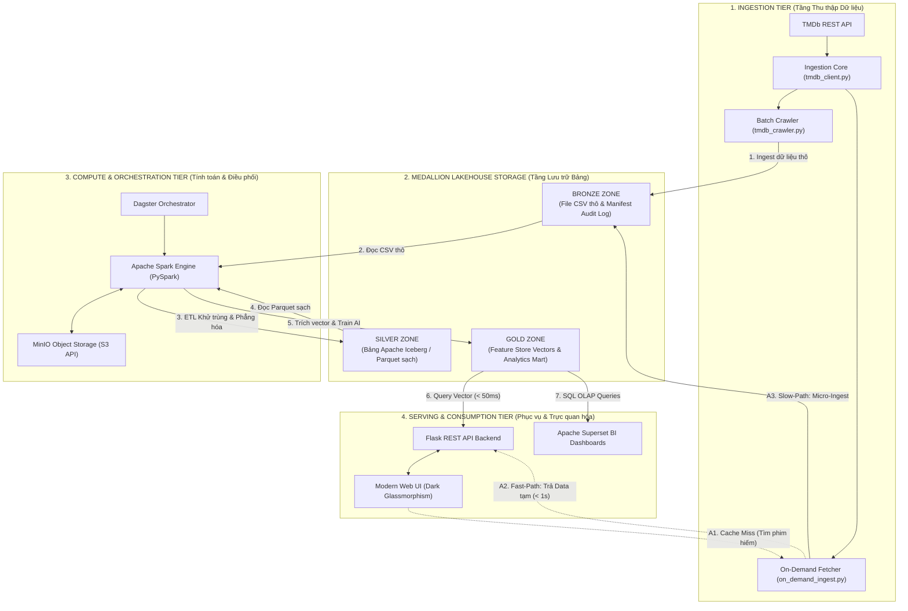
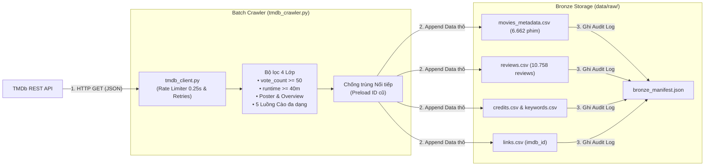
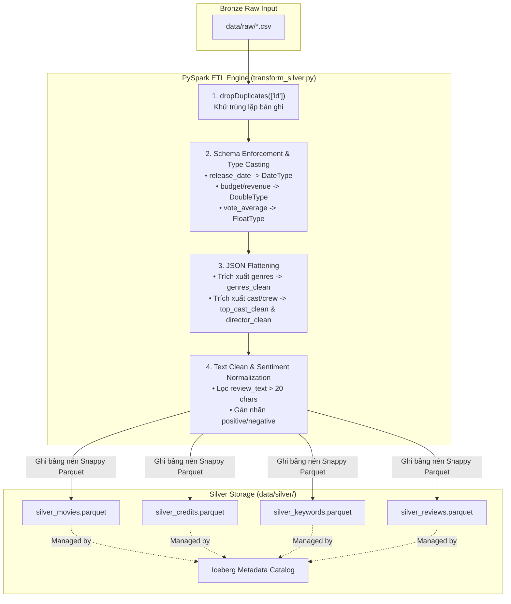
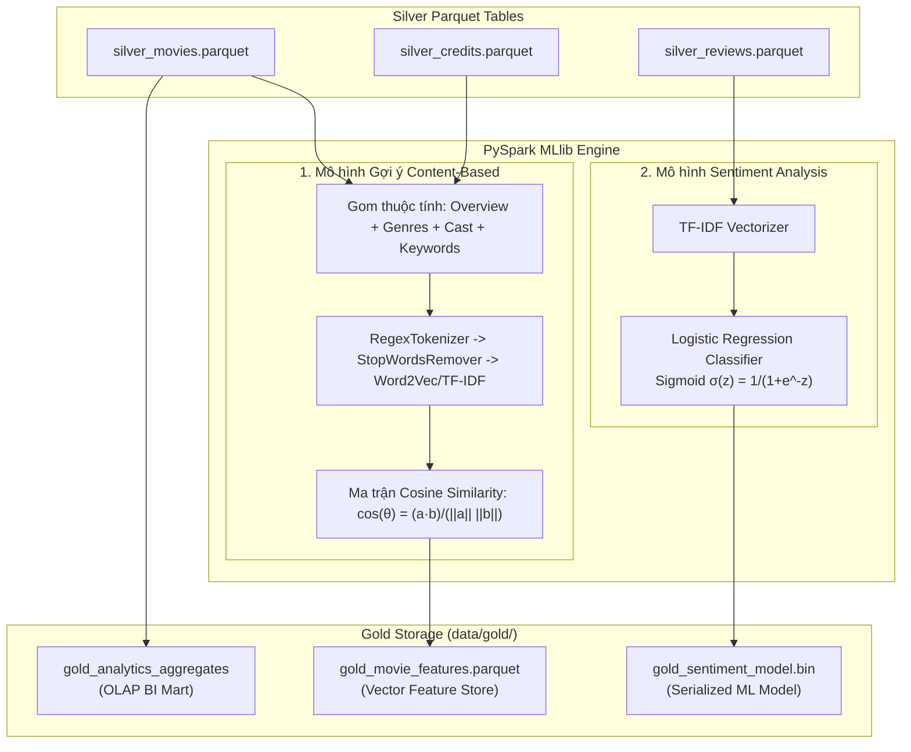
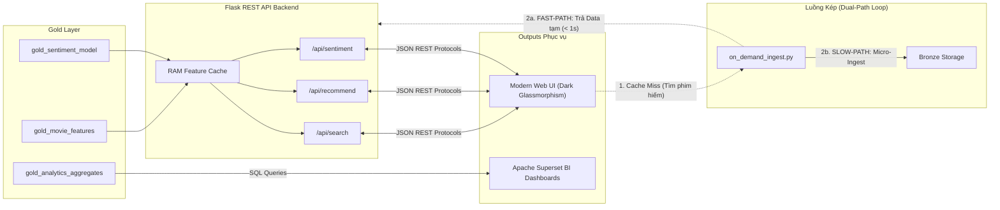

# TÀI LIỆU SƠ ĐỒ KIẾN TRÚC TINH GỌN VÀ CHI TIẾT TỪNG LAYER (MODULAR ARCHITECTURE)

**Tác giả thực hiện**: Lê Trần Tuấn Anh  
**Đề tài**: XÂY DỰNG DATA PLATFORM SỬ DỤNG MÃ NGUỒN MỞ PHỤC VỤ HỆ THỐNG GỢI Ý PHIM  

---

## 1. SƠ ĐỒ KIẾN TRÚC TỔNG THỂ TINH GỌN (EXECUTIVE SYSTEM OVERVIEW)

Sơ đồ tổng thể được thiết kế thanh thoát, tập trung biểu diễn dòng chảy dữ liệu chính giữa 4 tầng công nghệ mà không gây rối mắt:

---

## 2. CHI TIẾT SƠ ĐỒ THEO TỪNG LAYER CHUYÊN BIỆT (MODULAR LAYER DIAGRAMS)

Được chia nhỏ thành 4 sơ đồ thành phần độc lập, dễ dàng xem kỹ cấu trúc từng phần:

---

### PHẦN 1: CHI TIẾT TẦNG THU THẬP VÀ LƯU THÔ (INGESTION & BRONZE LAYER)

---

### PHẦN 2: CHI TIẾT TẦNG LÀM SẠCH VÀ CHUẨN HÓA (PYSPARK ETL & SILVER LAYER)

---

### PHẦN 3: CHI TIẾT TẦNG AI VÀ MA TRẬN VECTOR (GOLD LAYER & ML PIPELINE)

---

### PHẦN 4: CHI TIẾT TẦNG PHỤC VỤ VÀ LUỒNG KÉP FAST/SLOW PATH (SERVING & DUAL-PATH)

---

*Tài liệu sơ đồ kiến trúc này được chia nhỏ tinh gọn và chi tiết từng lớp theo thiết kế chuẩn của Lê Trần Tuấn Anh.*
